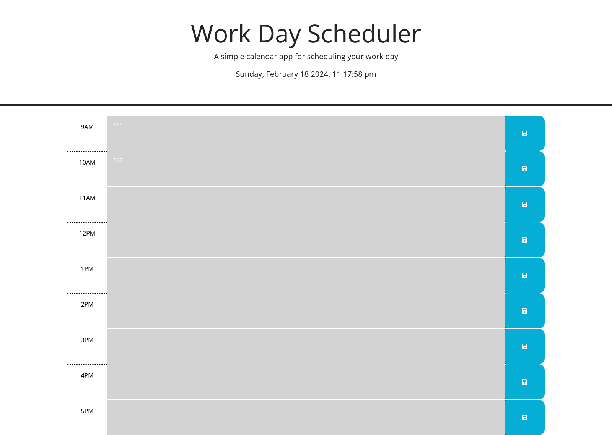

# Daily Planner

## Table of Contents

- [About](#about)
- [Usage](#usage)
- [Contributing](#contributing)
- [License](#license)

## About

Built a simple calendar application that allows a user to save events for each hour of a typical working day (9am&ndash;5pm) by modifying starter code. This app runs in the browser and features dynamically updated HTML and CSS powered by jQuery.

## Usage

[Link to website](https://gurleyryan.github.io/daily-planner/)

Click into a timeblock to type out an event and then click the save button. Timeblocks are color coded to indicate whether they are in the past, present, or future. Saved events will remain on refresh.

## Contributing

Contributors:  

- [Ryan Gurley](https://github.com/gurleyryan)

## License

Please refer to the [LICENSE](https://github.com/gurleyryan/daily-planner?tab=MIT-1-ov-file) in the repo.
